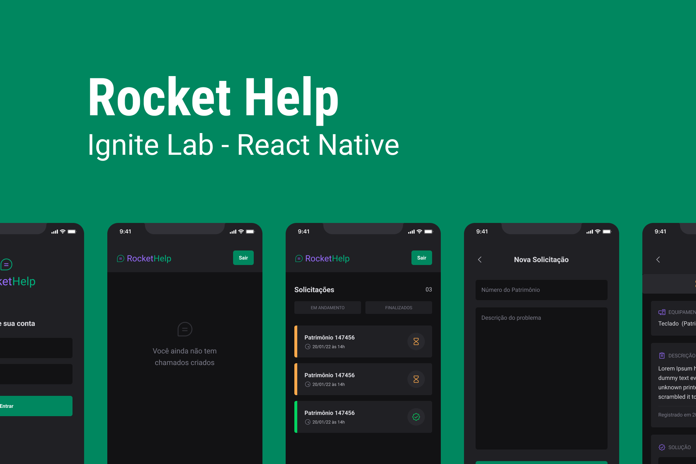
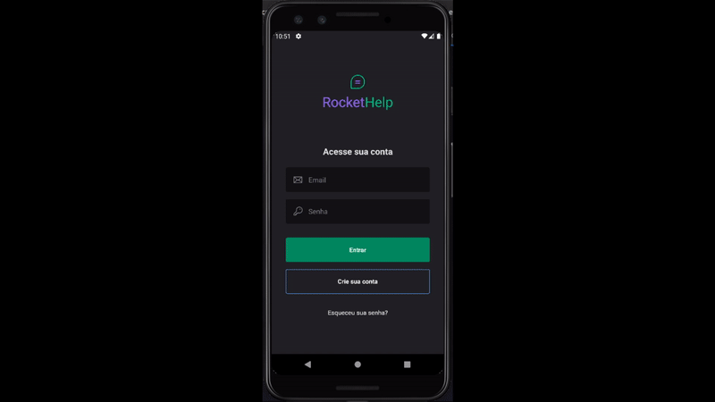

# :iphone: RocketHelp

<div align="center">
    
</div>

---

## :bookmark_tabs: Sobre

- O Ignite Lab - React Native, foi um evento realizado pela [Rocketseat](https://www.rocketseat.com.br/), com um projeto de um aplicativo para criação de chamados, para resolução de problemas diversos, tendo como foco o aprimoramente em React Native.

---

## :art: Layout

- [Figma](https://www.figma.com/community/file/1130846653327904117)

---

## :gear: Techs

- [React Native](https://reactnative.dev/)
- [Expo](https://expo.dev/)
- [Native Base](https://nativebase.io/)
- [React Navigation](https://reactnavigation.org/)
- [Firebase](https://firebase.google.com/)

---

## :book: Features adicionais

- Verificação dos campos do formulário com Yup
- Criação de conta
- Recuperação de senha
- Visualização de somente as suas solicitações
- Personalização dos alertas com React Native Toast Message

<div align="center">
    
</div>
---
## :desktop_computer: Como usar
<strong>Antes de executar os comando abaixo, é necessário baixar os arquivos do projeto no Firebase, tanto do Android quanto do IOS e adicionar a pasta raiz do projeto.</strong>

Nome dos arquivos:
- google-services.json e GoogleService-info.plist

<br />

<p> Instalação das dependências: </p>

```
    yarn install
```

Para rodar o aplicativo é necessário a utilização do [Emulador](https://developer.android.com/studio), por isso o passo abaixo necessita que ele esteja aberto e que o [Expo-CLI](https://docs.expo.dev/workflow/expo-cli/) esteja instalado na sua máquina. Após tudo isso executar o comando abaixo:

```
    expo run:android
```

Esse comando roda o aplicativo no seu emulador Android, ou:
```
    expo run:ios
```

para rodar no emulador do IOS

---

## :books: License

Arquivos sob a licença [MIT](https://github.com/lucasgomesgp) criado por Lucas Gomes.
